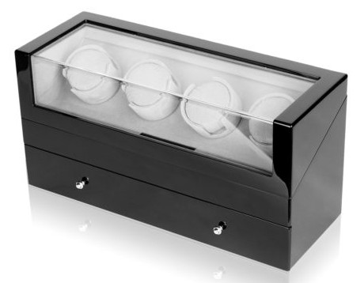
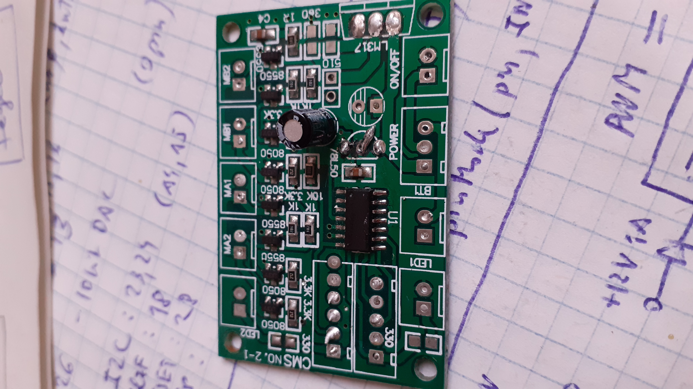
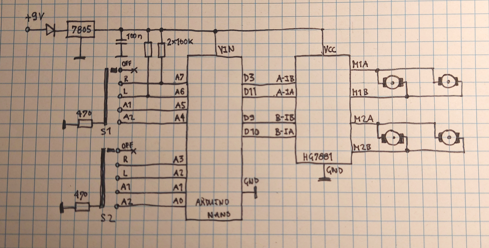
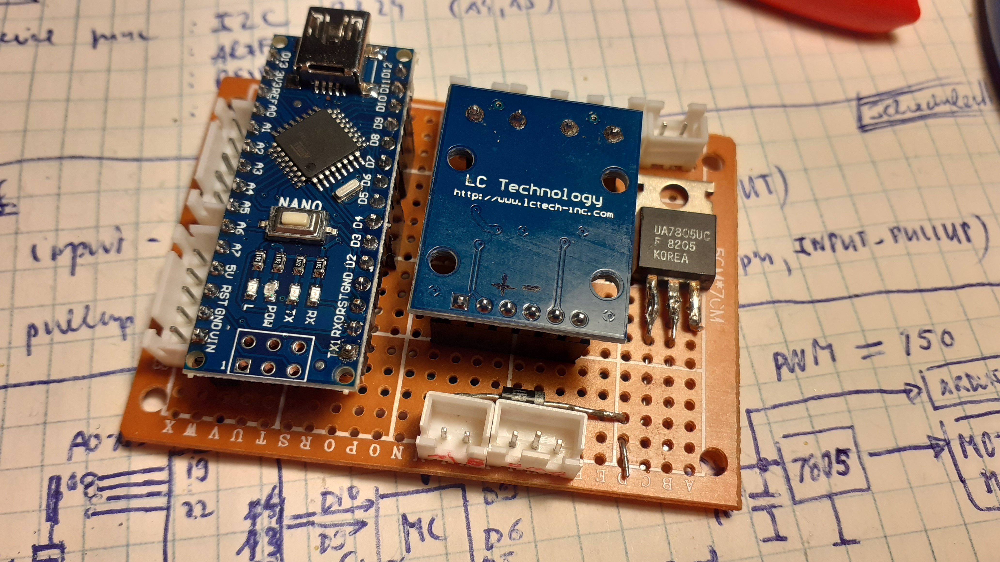
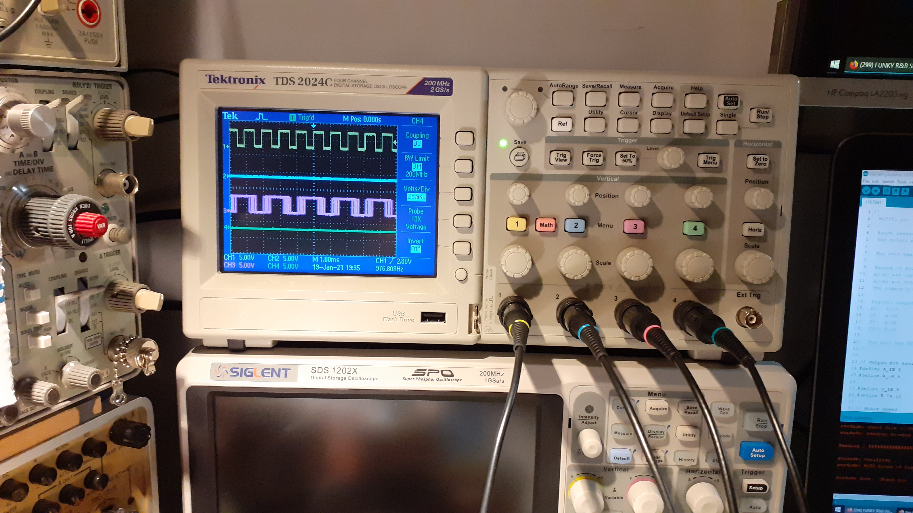

# Watch Winder

## What's this?

The watch winder is a machine that helps wind up automatic watches that do not have a battery but are driven by spring wound up by the movement of the user's arm. This tool can be very useful if someone has more of these watches or works in a watch repair shop for example.

The watches can be easily placed into one or more rotating trays of the unit. Instead of continuous rotating the trays should doing sequences of rotating and waiting cycles to prevent overwinding.

## About this project

The purpose of this project was to bring back to life a dead watch winder machine. Presumably it was destroyed by attaching an improper power supply.

This specific unit has four trays. Each of them are driven by a small 3V DC motor with a gear box. The motors of the first and the second trays are connected parallel. The motors of the third and fourth trays are connected the same way.
Both the left and right pair of trays have a 5-position switch: Off, Right, Left, Alternate1, Alternate2.

The original rotation and delay sequences could not be restored since the control board was destroyed.

The board had a 14-pin smd chip with no markings on the top. Here is a picture (the connectors are already removed):

## Rotation and delay timing

As far as the original program was unknown a working although a different type unit was observed.
The result is as follows:

- The motors are operated in 30min cycles.
- Left/Right mode: [30s run; 30s stop] repeated 12 times, then 18min stop.
- Alt1 mode: [30s run; 30s stop; reverse direction] repeated 12 times, then 18min stop.
- Alt2 mode: [30s run; 30s stop; reverse direction] repeated 6 times, then 24min stop.

## Schematic Diagram

The dead board was unusable so it was removed. A HG7881 dual bridge motor driver module was chosen with Arduino Nano control.

The switches are connected to the analog input pins with internal pull-up resistors enabled. A6 and A7 pins have no such resistors so external ones was used.
The motor driver module is connected to the D3-D11 and D9-D10 pins.
The common pin of both switches are grounded through a 470 Ohm current limiter resistor.
Power is supplied through a polarity protector diode and a 7805 voltage stabilizer. (There is no buffer capacitor on the board because the applied power supply already has that.)

The components were wired on a breakout board.

## PWM Control

Motors are 3V ones so the power of them should be decreased to 3V (on full power). This was achieved by applying a PWM driver voltage with about 60% duty cycle on max speed. Whenever the motors are turned on or off the duty cycle is adjusted continuously so the speed is changed smoothly.

The default PWM frequency of the Nano is 490Hz which results in an audible and disturbing motor noise. To eliminate that the PWM frequency must be increased.

There are 3 PWM timers in the Nano which can be controlled by global registers:

**TCCR0B:**

Pins 5 and 6 controlled by Timer0 in fast PWM mode (cycle length = 256)
If you change TCCR0B, it affects millis() and delay(). They will count time
faster or slower than normal if you change the TCCR0B settings.

	Setting 	Divisor 	Frequency
	0x01 	 	1 		 	62500
	0x02  		8 	 		7812.5
	0x03  		64 	 		976.5625   <--DEFAULT
	0x04 	 	256 	 	244.140625
	0x05 	 	1024 	 	61.03515625

	TCCR0B = (TCCR0B & 0b11111000) | <setting>;

**TCCR1B:**

Pins 9 and 10 controlled by Timer1 in phase-correct PWM mode (cycle length = 510)

	Setting 	Divisor 	Frequency
	0x01 	 	1 	 		31372.55
	0x02 	 	8 	 		3921.16
	0x03  		64 	 		490.20   <--DEFAULT
	0x04  		256 	 	122.55
	0x05 	 	1024 	 	30.64

	TCCR1B = (TCCR1B & 0b11111000) | <setting>;

**TCCR2B:**

Pins 11 and 3 controlled by Timer2 in phase-correct PWM mode (cycle length = 510)

	Setting 	Divisor 	Frequency
	0x01 	 	1  			31372.55
	0x02 	 	8 	 		3921.16
	0x03  		32  		980.39
	0x04 	 	64 	 		490.20   <--DEFAULT
	0x05 	 	128  		245.10
	0x06  		256  		122.55
	0x07 	 	1024  		30.64

	TCCR2B = (TCCR2B & 0b11111000) | <setting>;

All frequencies are in Hz and assume a 16MHz system clock.

In order to prevent original system timings Timer0 was not changed. Timer1 and Timer2 was set to the highest frequency by modifying the divisor values to 1:

	// Set PWM timers to the max frequency to eliminate audible PWM noise.
	// Pin 9 and 10 are controlled by timer 1
	TCCR1B = (TCCR1B & 0b11111000) | 0x01;
	// Pin 3 and 11 are controlled by timer 2
	TCCR2B = (TCCR2B & 0b11111000) | 0x01;

The following picture shows the PWM signal on CH1 with divisor value 32 which results a 1kHz annoying motor noise:

## The code

The machine is controlled by a state machine built up by many classes.

The program can be switched to test mode through the serial interface by entering menu commands. In this mode the delays are short to allow observing the operation.
